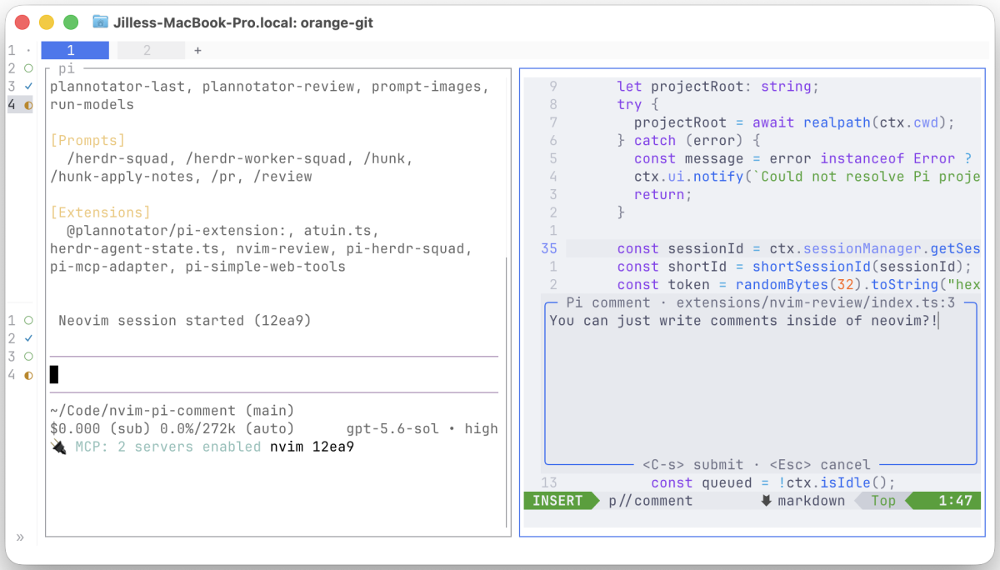

# pi-nvim-review



`pi-nvim-review` connects Neovim to a live [Pi](https://pi.dev) session. Mark lines in Neovim, write review comments, and submit the full review to Pi as one user message.

The repository is both:

- a Pi package with a TypeScript extension;
- a Neovim plugin with no Lua plugin dependency.

## Requirements

- Pi with extension package support
- Node.js 20 or newer for the Pi extension
- Neovim 0.10 or newer

## Installation

Install the GitHub repository in both Pi and Neovim.

### Pi

```sh
pi install git:github.com/jillesme/pi-nvim-review
```

Pi packages run with full system access. Review the source before you install a third-party package.

### Neovim

With lazy.nvim:

```lua
{
  "jillesme/pi-nvim-review",
}
```

Use `jillesme/pi-nvim-review` as the source with other Neovim plugin managers. Restart Pi and Neovim after installation. Run `/nvim` in Pi and `:help pi-nvim` in Neovim to confirm that both parts loaded.

### Local development

To use a local checkout instead, install its Pi package and point Neovim at the same directory:

```sh
pi install /absolute/path/to/pi-nvim-review
```

```lua
{
  dir = "/absolute/path/to/pi-nvim-review",
}
```

For a one-time Pi run, load the extension directly:

```sh
pi -e /absolute/path/to/pi-nvim-review/extensions/nvim-review/index.ts
```

## Commands

| Command | Action |
| --- | --- |
| `:Pi` | List live sessions for Neovim's canonical current working directory and select one. |
| `:[range]PiAnnotate` | Add a comment to the current line or supplied line range. |
| `:PiSubmit` | Submit all pending comments to the active session. |
| `:PiClear` | Remove all pending comments without submitting them. |

Neovim requires user commands to start with an uppercase letter. This is why the commands use `:Pi` and `:PiSubmit`, not lowercase or hyphenated names.

## Workflow

1. Start Pi in the project root.
2. Run `/nvim` in Pi.

   Pi starts a local bridge and reports a short ID:

   ```text
   Neovim session started (abc13)
   ```

3. Keep that Pi process open. Open Neovim with the same project root as its current working directory.
4. Run `:Pi`, move through the modal session picker, and press `<Enter>` on `abc13`.
5. Add comments:
   - normal mode `<leader>pa` opens a multiline comment modal for the current line;
   - visual mode `<leader>pa` opens it for the selected line range;
   - press `<C-s>` to save the comment or `<Esc>` to cancel it.
6. Run `<leader>ps` or `:PiSubmit`.

Pi receives one user message with sorted project-relative paths, current line ranges, source excerpts, and comments. If Pi is idle, processing starts immediately. If Pi is busy, the review is queued as a follow-up and does not interrupt the current task.

After Pi accepts the message, Neovim removes the submitted signs and comments. The selected session stays active, so you can start another review cycle.

## Review prompt

By default, the bridge treats each comment according to its requested outcome: it implements change requests, answers questions without editing files, handles mixed comments one part at a time, and asks for clarification when the intent is ambiguous. Classification uses meaning rather than punctuation, so `Can you rename this?` is a change request while `Can you explain this?` is a question.

To replace the default review instructions for one project, create `.pi/nvim-review-prompt.md` in the project root. For example:

```md
Process each review comment independently according to its requested outcome.

- If a comment asks for an explanation or information, answer it directly. Do not modify files for that comment.
- If a comment requests a code change, implement it.
- If a comment contains both a question and a change request, answer the question and implement only the explicit change.
- If the intent is ambiguous, explain the ambiguity and ask for clarification instead of making a speculative change.
- Classify by meaning, not grammar or punctuation.

Inspect the current files before answering or editing.

In the final response, use separate sections for changes made, questions answered, and comments that need clarification.
```

The bridge reads this file for each submission. Its contents replace the standard opening instructions. The project root and the structured review comments, including file paths, line ranges, comments, and source excerpts, are always appended. An empty file omits the opening instructions. If the file does not exist, the bridge uses the default instructions.

If the file exists but cannot be read, submission fails and Neovim keeps the pending comments so that you can fix the file and retry.

## Modal controls

`:Pi` opens a centered session picker. Use `j`/`k` or `<C-n>`/`<C-p>` to move, `<Enter>` to select, and `<Esc>` or `q` to cancel.

`:PiAnnotate` opens a bordered multiline editor below the selected or current line when there is enough room. It uses a centered file-window fallback near the bottom of the screen. Press `<C-s>` in normal or insert mode to add the comment. Press `<Esc>`, `<C-c>`, or normal-mode `q` to cancel it.

## Mappings

The plugin defines these `<Plug>` targets:

- `<Plug>(PiAnnotate)` in normal and visual modes
- `<Plug>(PiSubmit)` in normal mode

It adds the following defaults only when the left-hand side is free and no mapping already targets the matching `<Plug>` mapping:

| Mode | Default | Action |
| --- | --- | --- |
| Normal | `<leader>pa` | Annotate current line |
| Visual | `<leader>pa` | Annotate selected lines |
| Normal | `<leader>ps` | Submit comments |

To define your own mappings, disable defaults before the plugin loads:

```lua
vim.g.pi_nvim_disable_default_mappings = true

vim.keymap.set({ "n", "x" }, "<leader>pc", "<Plug>(PiAnnotate)")
vim.keymap.set("n", "<leader>pr", "<Plug>(PiSubmit)")
```

With lazy.nvim, put the global option in `init`:

```lua
{
  dir = "/absolute/path/to/pi-nvim-review",
  init = function()
    vim.g.pi_nvim_disable_default_mappings = true
  end,
}
```

## Configuration

Defaults work without calling `setup()`.

```lua
require("pi_nvim").setup({
  timeout_ms = 3000,
  registry_dir = nil,
})
```

- `timeout_ms` controls ping and submission timeouts.
- `registry_dir` changes where Neovim reads live-session manifests. The Pi process must use the same directory.

The simplest shared registry override is an environment variable set for both Pi and Neovim:

```sh
export PI_NVIM_REGISTRY="$HOME/.cache/pi-nvim-sessions"
```

By default, both plugins use a user-specific directory below the operating system temporary directory.

## MVP restrictions

- **The Pi process must stay open.** The bridge belongs to the Pi process that handled `/nvim`. Pi exit, session replacement, or `/reload` closes it. A future version can move ownership to a detached Pi RPC process.
- **Comments are in memory only.** Exiting Neovim loses comments that were not submitted.
- **The project root must match.** `:Pi` compares Pi's canonical startup directory with Neovim's canonical `getcwd()`. Use `:cd` to enter the Pi project root before `:Pi`.
- **Pending comments lock session selection.** While comments are pending, `:Pi` will not change sessions. Use `:PiSubmit` or `:PiClear` first. This prevents comments from going to the wrong Pi session.
- **Only existing project files are accepted.** Unnamed buffers, special buffers, missing files, and files that resolve outside the selected project root cannot be annotated.
- Source excerpts can contain unsaved Neovim buffer text. Save related edits before Pi changes the same files to avoid normal editor/disk conflicts.

## Failure behavior

A submission clears comments only after the selected Pi bridge validates and accepts it. Invalid payloads, timeouts, dead sessions, and delivery errors keep all comments for retry.

A Pi crash can leave a stale temporary manifest. `:Pi` filters dead process IDs and removes a selected manifest when its authenticated ping fails.

## Local protocol

`/nvim` binds an ephemeral TCP port on `127.0.0.1`. Its discovery manifest and random access token use user-only filesystem permissions. The versioned JSON-line protocol validates the token, session identity, project root, relative paths, annotation fields, and bounded payload sizes. The server accepts one request per connection.

Use `:help pi-nvim` for the Neovim reference.
